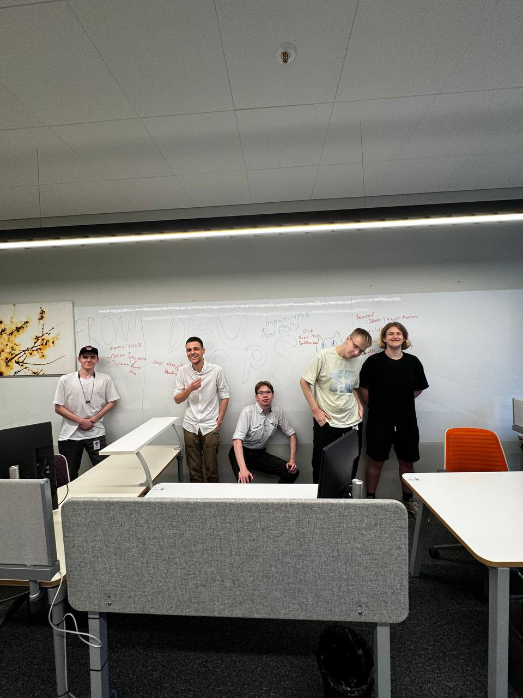

# Mobile-Application-Development
mobile legends dota2

---
[Техническое задание](https://docs.google.com/document/d/19EbI7onniHpw-NijgQJvr-GfJcA08sypUZD5BsKHaIA)

---

[UML для ТЗ](https://drive.google.com/file/d/1kRv67lUsDyv0qh-GUjR1P0fGFw56xTM7/view?usp=sharing) 

---

[Отчет](https://docs.google.com/document/d/1Xqb-bXPv_Bg9IcyUBLPAhYoPMHt1TpCsZHgea9wEncQ)

---

[Документация](https://github.com/FooolyHARD/Mobile-Application-Development/blob/main/back/README.md#%D0%B4%D0%BE%D0%BA%D1%83%D0%BC%D0%B5%D0%BD%D1%82%D0%B0%D1%86%D0%B8%D1%8F-api-core-api)

---

Команда разработчиков (бтс с лева на право)

